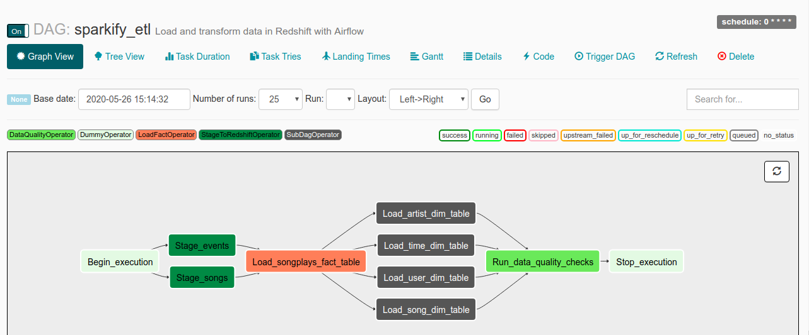
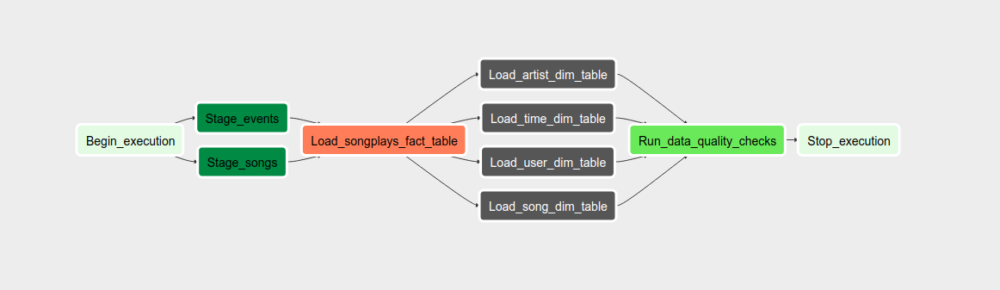

# Project: Data Pipelines with Airflow

A music streaming startup, Sparkify, has grown their user base and song database and want to move their processes and data onto the cloud. Their data resides in S3, in a directory of JSON logs on user activity on the app, as well as a directory with JSON metadata on the songs in their app.

In this project, we will create an ETL pipeline using Apache Airflow to build a data warehouses hosted on Redshift.

## Summary
* [Project structure](#Structure)
* [Datasets](#Datasets)
* [Schema](#Schema)
* [Execute](#Execute)

## Datasets

You'll be working with two datasets that reside in S3. Here are the S3 links for each:

* <b> Song data </b> - s3://udacity-dend/song_data
* <b> Log data </b> - s3://udacity-dend/log_data

#### Structure
* <b> /images </b> - some screenshots.
* <b> /dags </b> - folder containing dags.
* <b> /plugins </b> - folder containing etl scripts and custom operators. 

## Schema

#### Fact Table
songplays - records in event data associated with song plays. Columns for the table:

    songplay_id, start_time, user_id, level, song_id, artist_id, session_id, location, user_agent

#### Dimension Tables 
##### users

    user_id, first_name, last_name, gender, level
##### songs

    song_id, title, artist_id, year, duration

##### artists

    artist_id, name, location, lattitude, longitude

##### time

    start_time, hour, day, week, month, year, weekday
    
## Execute

1. Install Airflow, create variable AIRFLOW_HOME and AIRFLOW_CONFIG with the appropiate paths, and place dags and plugins on airflor_home directory.
2. Initialize Airflow data base with airflow initdb, and open webserver with airflow webserver
Access the server http://localhost:8080 
3. Create AWS Connection & Redshift Connection as follows

**AWS Connection**  
<b>Conn Id :</b> Enter aws_credentials.  
<b>Conn Type :</b> Enter Amazon Web Services.  
<b>Login :</b> Enter your Access key ID from the IAM User credentials you downloaded earlier.  
<b>Password :</b> Enter your Secret access key from the IAM User credentials you downloaded earlier.   

**Redshift Connection**  
<b>Conn Id :</b> Enter redshift.  
<b>Conn Type :</b> Enter Postgres.  
<b>Host :</b> Enter the endpoint of your Redshift cluster, excluding the port at the end.   
<b>Schema :</b> This is the Redshift database you want to connect to.  
<b>Login :</b> Enter awsuser.  
<b>Password :</b> Enter the password created when launching the Redshift cluster.  
<b>Port :</b> Enter 5439.  

* Task dependencies are set as following:

